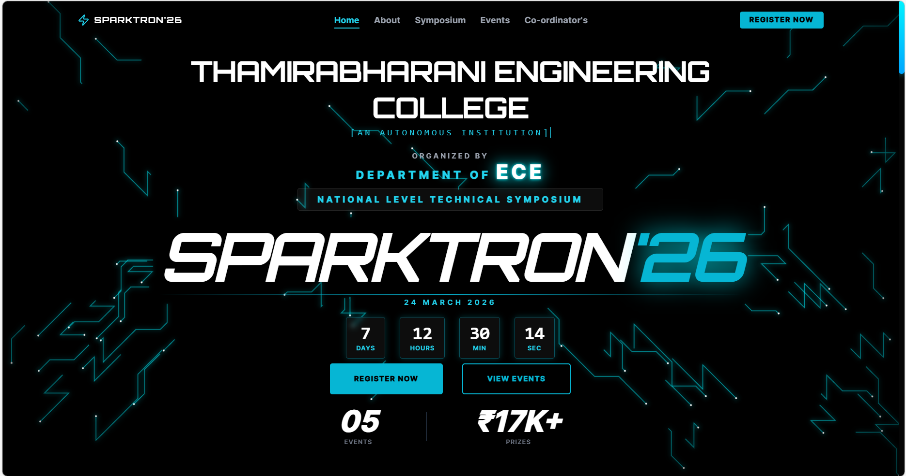
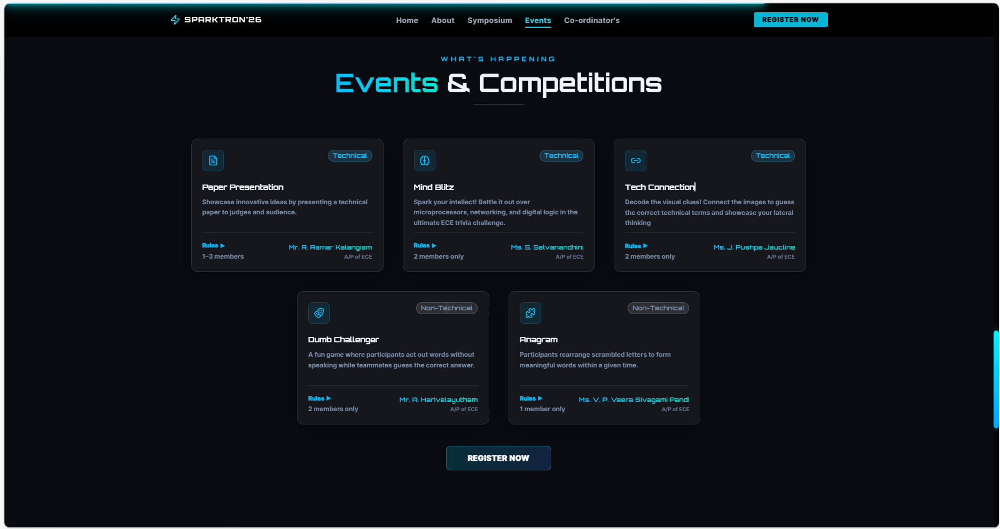
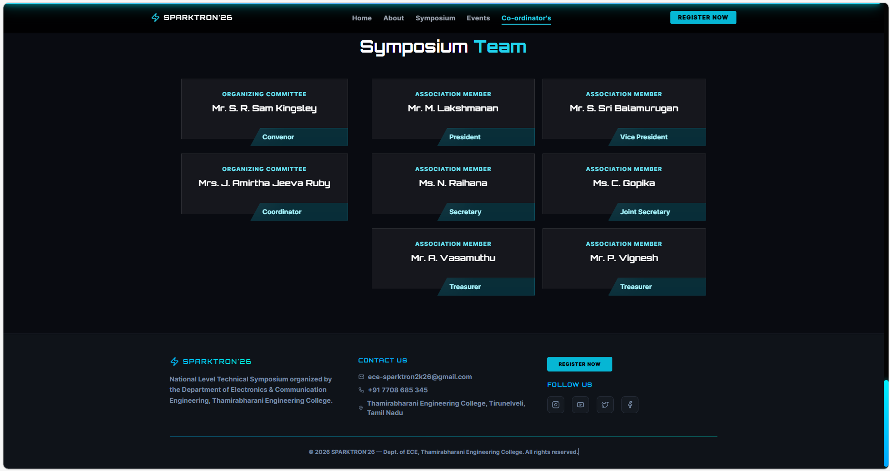

<div align="center">

<!-- Animated header banner -->


<!-- Typing animation -->
<a href="https://git.io/typing-svg">
  
</a>

<br/><br/>

<!-- Badges row -->


<br/><br/>

<!-- Stat badges -->


</div>

---

<div align="center">

## 🌐 Live Demo

<a href="https://ece-sparktron.vercel.app/">
  
</a>

</div>

---

## 📖 About

> **SPARKTRON'2k26** is a National Level Technical Symposium organized by the **Department of Electronics & Communication Engineering**, Thamirabharani Engineering College — bringing together engineering students from across the country to showcase innovation, compete, and connect.

The website serves as the official platform for event registration, schedule info, and competition details — built with a modern, circuit-board-inspired dark UI.

---

## 📸 Screenshots

<div align="center">

| Home Page | Events Section | Footer & Team |
|:---------:|:--------------:|:-------------:|
|  |  |  |

</div>

---

## ✨ Features

<div align="center">

| Feature | Description |
|---------|-------------|
| ⚡ **Live Countdown** | Real-time countdown timer to the symposium date |
| 📋 **Event Cards** | Expandable per-event rules and coordinator details |
| 🧾 **Registration Modal** | UPI QR code + embedded Google Form |
| 🎨 **Circuit Animation** | Animated canvas circuit-line background |
| 📱 **Fully Responsive** | Optimized layout for mobile and desktop |
| 🔵 **Scroll Progress Bar** | Glowing cyan progress indicator |
| 🏢 **Sponsors Marquee** | Auto-scrolling sponsor banner |
| 🔗 **Active Nav Highlight** | Intersection Observer–driven navbar highlighting |

</div>

---

## 🛠 Tech Stack

<div align="center">


</div>

---

## 🚀 Getting Started

```bash
# 1. Clone the repository
git clone https://github.com/codefuser/sympo.git
cd sympo

# 2. Install dependencies
npm install

# 3. Start the dev server
npm run dev
```

Open **http://localhost:5173** in your browser.

```bash
# Build for production
npm run build

# Preview production build
npm run preview
```

---

## 📁 Project Structure

```
sparktron-2k26/
├── public/
│   ├── sponsors/          # Sponsor logo images
│   ├── sparktron-preview.png
│   └── favicon.ico
├── src/
│   ├── assets/            # PaymentQR.png
│   ├── components/
│   │   ├── HeroSection.tsx       # Animated hero + countdown
│   │   ├── AboutSection.tsx      # College & ECE dept info
│   │   ├── SymposiumSection.tsx  # Event schedule & theme
│   │   ├── EventsSection.tsx     # Events with rules cards
│   │   ├── FacultySection.tsx    # Organizing committee
│   │   ├── RegisterModal.tsx     # Registration + QR modal
│   │   ├── Sponsors.tsx          # Auto-scroll sponsor strip
│   │   ├── Navbar.tsx            # Sticky nav + active links
│   │   ├── Footer.tsx            # Contact + social links
│   │   ├── ScrollProgress.tsx    # Scroll progress bar
│   │   └── ui/                   # shadcn/ui components
│   ├── pages/
│   │   ├── Index.tsx
│   │   └── NotFound.tsx
│   ├── hooks/
│   ├── lib/
│   └── img/               # README screenshots
└── README.md
```

---

## 📅 Event Schedule — March 24, 2026

```
🌅 Morning Session                    🌆 Afternoon Session
─────────────────────────────         ─────────────────────────────
09:00 AM  Registration & Check-in     01:00 PM  Lunch Break
09:30 AM  Inauguration Ceremony       02:00 PM  Dumb Charade
10:30 AM  Paper Presentation          02:30 PM  Anagram
11:00 AM  Technical Connection        03:00 PM  Prize Distribution
12:00 PM  Mind Blitz
```

---

## 🏆 Events

| Event | Category | Team Size |
|-------|----------|-----------|
| 📄 Paper Presentation | Technical | 1–2 members |
| 🧠 Mind Blitz | Technical | 1 member |
| 🔗 Tech Connection | Technical | 2 members |
| 🎭 Dumb Charade | Non-Technical | 2 members |
| 🧩 Anagram | Non-Technical | 1 member |

---

## 📬 Contact

<div align="center">

| Channel | Details |
|---------|---------|
| 📧 Email | ecesparktron2k26@gmail.com |
| 📞 Phone | +91 7708 685 345 |
| 📍 Venue | Thamirabharani Engineering College, Tirunelveli, Tamil Nadu |
| 📸 Instagram | [@tec_edu_in](https://www.instagram.com/tec_edu_in/) |
| 🐦 Twitter/X | [@TEC_ENGG](https://x.com/TEC_ENGG) |

</div>

---

## 📄 License

This project is licensed under the **MIT License** — see the [LICENSE](LICENSE) file for details.

---

<div align="center">

## 👨‍💻 Developed By

**Codefuser**

[](https://github.com/codefuser)

<br/>

<!-- Footer wave -->


</div>
